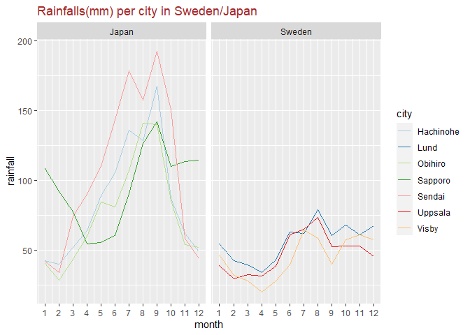
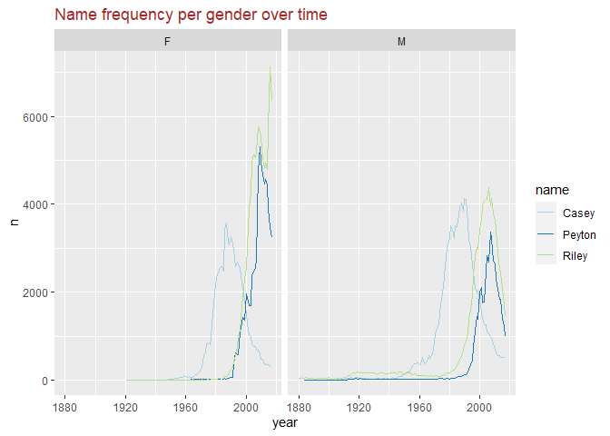

Assignment4
================
Jae Eun Hong
9/27/2021

## Preparing libraries

``` r
library(tidyverse)
library(readxl)
library(reshape2)
library(stringr)
library(dplyr)
library(ggplot2)
library(magrittr)
library(RColorBrewer)
library(babynames)
```

## 1. Japaneseclimate_messy data

``` r
japan_messy <- read.csv('C:/Users/wk789/Documents/school/UU/data visualisation/assignment4/japaneseclimate_messy.csv')

#city, rainfall column
japan_clean <- japan_messy %>% melt(measure.vars=grep('rain_mm', colnames(.)), variable.name='city', value.name="rainfall")

japan_clean$city <- japan_clean$city %>%
  gsub(x=., "_rain_mm", "")

#snowfall column
japan_clean <- japan_clean %>% melt( measure.vars=grep('snow_cm', colnames(.)), value.name='snowfall')  

japan_clean$variable <- japan_clean$variable %>% gsub(x=., "_snow_cm", "") 

#1. only saving the right column by matching city names
#2. getting rid of the variable column for the next column preparation 
japan_clean <- japan_clean %>% .[(.$variable == .$city), ] %>% subset(., select=-variable)


# temperature column 
japan_clean <- japan_clean %>% melt(measure.vars=grep('temp_deg', colnames(.)), value.name='temperature') 

japan_clean$variable <- japan_clean$variable %>% gsub(x=., "_temp_deg", "") 

japan_clean <- japan_clean %>% .[(.$variable == .$city), ] 

# month column 
japan_clean <- japan_clean %>% melt(measure.vars=grep('X.1', colnames(.)), value.name='month', variable.name='x') 
 


japan_clean <- japan_clean %>% subset(., select=-c(x, X, variable))

# changing column order 
japan_clean <- japan_clean[,c(1,5,4,2,3)]
japan_clean
```

    ##         city month temperature rainfall snowfall
    ## 1    Obihiro     1        -6.9     40.5       52
    ## 2    Obihiro     2        -5.7     28.8       37
    ## 3    Obihiro     3        -0.4     43.8       36
    ## 4    Obihiro     4         6.0     60.1        9
    ## 5    Obihiro     5        11.6     84.7        1
    ## 6    Obihiro     6        15.2     81.1        0
    ## 7    Obihiro     7        18.9    107.1        0
    ## 8    Obihiro     8        20.3    141.3        0
    ## 9    Obihiro     9        16.9    140.2        0
    ## 10   Obihiro    10        10.3     85.7        0
    ## 11   Obihiro    11         3.5     54.2       10
    ## 12   Obihiro    12        -3.8     52.3       51
    ## 13   Sapporo     1        -3.2    108.4      137
    ## 14   Sapporo     2        -2.7     91.9      116
    ## 15   Sapporo     3         1.1     77.6       74
    ## 16   Sapporo     4         7.3     54.6        6
    ## 17   Sapporo     5        13.0     55.5        0
    ## 18   Sapporo     6        17.0     60.4        0
    ## 19   Sapporo     7        21.1     90.7        0
    ## 20   Sapporo     8        22.3    126.8        0
    ## 21   Sapporo     9        18.6    142.2        0
    ## 22   Sapporo    10        12.1    109.9        1
    ## 23   Sapporo    11         5.2    113.8       30
    ## 24   Sapporo    12        -0.9    114.5      113
    ## 25 Hachinohe     1        -0.9     42.8       77
    ## 26 Hachinohe     2        -0.5     40.1       75
    ## 27 Hachinohe     3         2.7     52.0       47
    ## 28 Hachinohe     4         8.5     64.3        3
    ## 29 Hachinohe     5        13.1     89.3        0
    ## 30 Hachinohe     6        16.2    105.8        0
    ## 31 Hachinohe     7        20.1    136.1        0
    ## 32 Hachinohe     8        22.5    128.8        0
    ## 33 Hachinohe     9        18.9    167.6        0
    ## 34 Hachinohe    10        13.0     87.2        0
    ## 35 Hachinohe    11         6.9     62.0        6
    ## 36 Hachinohe    12         1.8     49.1       40
    ## 37    Sendai     1         2.0     42.3       21
    ## 38    Sendai     2         2.4     33.9       18
    ## 39    Sendai     3         5.5     74.4       11
    ## 40    Sendai     4        10.7     90.2        1
    ## 41    Sendai     5        15.6    110.2        0
    ## 42    Sendai     6        19.2    143.7        0
    ## 43    Sendai     7        22.9    178.4        0
    ## 44    Sendai     8        24.4    157.8        0
    ## 45    Sendai     9        21.2    192.6        0
    ## 46    Sendai    10        15.7    150.6        0
    ## 47    Sendai    11         9.8     58.7        0
    ## 48    Sendai    12         4.5     44.1        9

``` r
write.csv(japan_clean, "./japan_clean.csv", row.names = FALSE)
```

## 2. swedishclimate/Japanese data

``` r
sweden <- read.csv('C:/Users/wk789/Documents/school/UU/data visualisation/assignment4/swedishclimate.csv')

sweden$month <- match(sweden$month, month.name)
  
japan_clean <- japan_clean %>% mutate(., country='Japan')
japan_clean <- japan_clean %>% select(.,c(6,1,2,3,4))
japan_clean
```

    ##    country      city month temperature rainfall
    ## 1    Japan   Obihiro     1        -6.9     40.5
    ## 2    Japan   Obihiro     2        -5.7     28.8
    ## 3    Japan   Obihiro     3        -0.4     43.8
    ## 4    Japan   Obihiro     4         6.0     60.1
    ## 5    Japan   Obihiro     5        11.6     84.7
    ## 6    Japan   Obihiro     6        15.2     81.1
    ## 7    Japan   Obihiro     7        18.9    107.1
    ## 8    Japan   Obihiro     8        20.3    141.3
    ## 9    Japan   Obihiro     9        16.9    140.2
    ## 10   Japan   Obihiro    10        10.3     85.7
    ## 11   Japan   Obihiro    11         3.5     54.2
    ## 12   Japan   Obihiro    12        -3.8     52.3
    ## 13   Japan   Sapporo     1        -3.2    108.4
    ## 14   Japan   Sapporo     2        -2.7     91.9
    ## 15   Japan   Sapporo     3         1.1     77.6
    ## 16   Japan   Sapporo     4         7.3     54.6
    ## 17   Japan   Sapporo     5        13.0     55.5
    ## 18   Japan   Sapporo     6        17.0     60.4
    ## 19   Japan   Sapporo     7        21.1     90.7
    ## 20   Japan   Sapporo     8        22.3    126.8
    ## 21   Japan   Sapporo     9        18.6    142.2
    ## 22   Japan   Sapporo    10        12.1    109.9
    ## 23   Japan   Sapporo    11         5.2    113.8
    ## 24   Japan   Sapporo    12        -0.9    114.5
    ## 25   Japan Hachinohe     1        -0.9     42.8
    ## 26   Japan Hachinohe     2        -0.5     40.1
    ## 27   Japan Hachinohe     3         2.7     52.0
    ## 28   Japan Hachinohe     4         8.5     64.3
    ## 29   Japan Hachinohe     5        13.1     89.3
    ## 30   Japan Hachinohe     6        16.2    105.8
    ## 31   Japan Hachinohe     7        20.1    136.1
    ## 32   Japan Hachinohe     8        22.5    128.8
    ## 33   Japan Hachinohe     9        18.9    167.6
    ## 34   Japan Hachinohe    10        13.0     87.2
    ## 35   Japan Hachinohe    11         6.9     62.0
    ## 36   Japan Hachinohe    12         1.8     49.1
    ## 37   Japan    Sendai     1         2.0     42.3
    ## 38   Japan    Sendai     2         2.4     33.9
    ## 39   Japan    Sendai     3         5.5     74.4
    ## 40   Japan    Sendai     4        10.7     90.2
    ## 41   Japan    Sendai     5        15.6    110.2
    ## 42   Japan    Sendai     6        19.2    143.7
    ## 43   Japan    Sendai     7        22.9    178.4
    ## 44   Japan    Sendai     8        24.4    157.8
    ## 45   Japan    Sendai     9        21.2    192.6
    ## 46   Japan    Sendai    10        15.7    150.6
    ## 47   Japan    Sendai    11         9.8     58.7
    ## 48   Japan    Sendai    12         4.5     44.1

``` r
climate <- rbind(japan_clean, sweden)
climate
```

    ##    country      city month temperature rainfall
    ## 1    Japan   Obihiro     1        -6.9     40.5
    ## 2    Japan   Obihiro     2        -5.7     28.8
    ## 3    Japan   Obihiro     3        -0.4     43.8
    ## 4    Japan   Obihiro     4         6.0     60.1
    ## 5    Japan   Obihiro     5        11.6     84.7
    ## 6    Japan   Obihiro     6        15.2     81.1
    ## 7    Japan   Obihiro     7        18.9    107.1
    ## 8    Japan   Obihiro     8        20.3    141.3
    ## 9    Japan   Obihiro     9        16.9    140.2
    ## 10   Japan   Obihiro    10        10.3     85.7
    ## 11   Japan   Obihiro    11         3.5     54.2
    ## 12   Japan   Obihiro    12        -3.8     52.3
    ## 13   Japan   Sapporo     1        -3.2    108.4
    ## 14   Japan   Sapporo     2        -2.7     91.9
    ## 15   Japan   Sapporo     3         1.1     77.6
    ## 16   Japan   Sapporo     4         7.3     54.6
    ## 17   Japan   Sapporo     5        13.0     55.5
    ## 18   Japan   Sapporo     6        17.0     60.4
    ## 19   Japan   Sapporo     7        21.1     90.7
    ## 20   Japan   Sapporo     8        22.3    126.8
    ## 21   Japan   Sapporo     9        18.6    142.2
    ## 22   Japan   Sapporo    10        12.1    109.9
    ## 23   Japan   Sapporo    11         5.2    113.8
    ## 24   Japan   Sapporo    12        -0.9    114.5
    ## 25   Japan Hachinohe     1        -0.9     42.8
    ## 26   Japan Hachinohe     2        -0.5     40.1
    ## 27   Japan Hachinohe     3         2.7     52.0
    ## 28   Japan Hachinohe     4         8.5     64.3
    ## 29   Japan Hachinohe     5        13.1     89.3
    ## 30   Japan Hachinohe     6        16.2    105.8
    ## 31   Japan Hachinohe     7        20.1    136.1
    ## 32   Japan Hachinohe     8        22.5    128.8
    ## 33   Japan Hachinohe     9        18.9    167.6
    ## 34   Japan Hachinohe    10        13.0     87.2
    ## 35   Japan Hachinohe    11         6.9     62.0
    ## 36   Japan Hachinohe    12         1.8     49.1
    ## 37   Japan    Sendai     1         2.0     42.3
    ## 38   Japan    Sendai     2         2.4     33.9
    ## 39   Japan    Sendai     3         5.5     74.4
    ## 40   Japan    Sendai     4        10.7     90.2
    ## 41   Japan    Sendai     5        15.6    110.2
    ## 42   Japan    Sendai     6        19.2    143.7
    ## 43   Japan    Sendai     7        22.9    178.4
    ## 44   Japan    Sendai     8        24.4    157.8
    ## 45   Japan    Sendai     9        21.2    192.6
    ## 46   Japan    Sendai    10        15.7    150.6
    ## 47   Japan    Sendai    11         9.8     58.7
    ## 48   Japan    Sendai    12         4.5     44.1
    ## 49  Sweden   Uppsala     1        -2.7     39.3
    ## 50  Sweden   Uppsala     2        -2.8     29.7
    ## 51  Sweden   Uppsala     3         0.2     32.6
    ## 52  Sweden   Uppsala     4         5.2     31.7
    ## 53  Sweden   Uppsala     5        10.9     38.7
    ## 54  Sweden   Uppsala     6        14.7     61.0
    ## 55  Sweden   Uppsala     7        17.7     65.1
    ## 56  Sweden   Uppsala     8        16.2     73.6
    ## 57  Sweden   Uppsala     9        11.4     52.4
    ## 58  Sweden   Uppsala    10         6.5     53.1
    ## 59  Sweden   Uppsala    11         1.8     52.9
    ## 60  Sweden   Uppsala    12        -1.7     45.6
    ## 61  Sweden     Visby     1         1.6     46.5
    ## 62  Sweden     Visby     2         1.2     32.0
    ## 63  Sweden     Visby     3         2.3     27.9
    ## 64  Sweden     Visby     4         6.1     20.2
    ## 65  Sweden     Visby     5        11.0     28.2
    ## 66  Sweden     Visby     6        15.3     39.8
    ## 67  Sweden     Visby     7        18.2     64.8
    ## 68  Sweden     Visby     8        18.5     58.6
    ## 69  Sweden     Visby     9        14.6     40.1
    ## 70  Sweden     Visby    10        10.0     57.4
    ## 71  Sweden     Visby    11         6.2     60.9
    ## 72  Sweden     Visby    12         3.5     57.8
    ## 73  Sweden      Lund     1         0.9     54.5
    ## 74  Sweden      Lund     2         1.0     42.7
    ## 75  Sweden      Lund     3         3.2     39.7
    ## 76  Sweden      Lund     4         7.8     33.9
    ## 77  Sweden      Lund     5        12.4     43.1
    ## 78  Sweden      Lund     6        15.8     62.9
    ## 79  Sweden      Lund     7        18.3     62.3
    ## 80  Sweden      Lund     8        17.9     79.3
    ## 81  Sweden      Lund     9        14.0     60.5
    ## 82  Sweden      Lund    10         9.3     68.1
    ## 83  Sweden      Lund    11         5.2     61.3
    ## 84  Sweden      Lund    12         2.3     67.8

``` r
# drawing rainfall per city graph 

ggplot(data=climate, aes(x=month,y=rainfall, color=city)) + geom_line() + facet_wrap(~country)+scale_color_brewer(palette = "Paired") + scale_x_continuous(breaks=c(1:12))+
  ggtitle("Rainfalls(mm) per city in Sweden/Japan")+
  theme(plot.title = element_text(color='Brown'))
```

<!-- -->

First of all, the average amount of rainfall in Japan is higher than
Sweden throughout the year. Especially during the summer times
(June-August), 4 Japanese cities show over 100mm rainfalls. Sweden,
however, shows around 60mm for all three cities, almost half of the
rainfalls compared to Japan. In the winter times, Sweden, in general ,
tend to rain slightly more than Japan except for the Japanese city
called *Sapporo*. This graph shows that Japanese summer is significantly
more humid than the swedish summer and vice versa in winter.

``` r
# Japanese city Sendai has the highest average annual temperature by ca 12.825. 

climate_mean <- climate %>% group_by(., city) %>% summarise(m=round(mean(temperature),3)) 
climate_mean <- climate_mean %>% arrange(., .$city, desc(.$m))
climate_mean %>% arrange(desc(m))
```

    ## # A tibble: 7 x 2
    ##   city          m
    ##   <chr>     <dbl>
    ## 1 Sendai    12.8 
    ## 2 Hachinohe 10.2 
    ## 3 Sapporo    9.24
    ## 4 Visby      9.04
    ## 5 Lund       9.01
    ## 6 Obihiro    7.16
    ## 7 Uppsala    6.45

## 3. Androgynous names

``` r
bbyname <- babynames %>% group_by(., name, sex) %>% summarise( total_n=sum(n))
androgynous <- bbyname %>% spread(., key=sex, value=total_n) %>% drop_na(F, M)

# Finding names that are used for both
androgynous['name']
```

    ## # A tibble: 10,663 x 1
    ## # Groups:   name [10,663]
    ##    name   
    ##    <chr>  
    ##  1 Aaden  
    ##  2 Aadi   
    ##  3 Aadyn  
    ##  4 Aalijah
    ##  5 Aaliyah
    ##  6 Aaliyan
    ##  7 Aamari 
    ##  8 Aamir  
    ##  9 Aaren  
    ## 10 Aareon 
    ## # ... with 10,653 more rows

``` r
#total num of occurences of each name/ select those that occur more than 100000 times
androgynous$total_num <- androgynous$F + androgynous$M
androgynous_filtered <- androgynous %>% filter(total_num > 100000) %>% arrange(desc(total_num))

androgynous_filtered
```

    ## # A tibble: 647 x 4
    ## # Groups:   name [647]
    ##    name          F       M total_num
    ##    <chr>     <int>   <int>     <int>
    ##  1 James     23356 5150472   5173828
    ##  2 John      21676 5115466   5137142
    ##  3 Robert    20100 4814815   4834915
    ##  4 Michael   21712 4350824   4372536
    ##  5 Mary    4123200   15160   4138360
    ##  6 William   15949 4102604   4118553
    ##  7 David     12896 3611329   3624225
    ##  8 Joseph    10638 2603445   2614083
    ##  9 Richard    9531 2563082   2572613
    ## 10 Charles   12405 2386048   2398453
    ## # ... with 637 more rows

``` r
#finding faily even distribution betweene boys/girls

androgynous_filtered$f_prop <- androgynous_filtered$F / androgynous_filtered$total_num
androgynous_filtered$m_prop <- androgynous_filtered$M / androgynous_filtered$total_num
androgynous_filtered
```

    ## # A tibble: 647 x 6
    ## # Groups:   name [647]
    ##    name          F       M total_num  f_prop  m_prop
    ##    <chr>     <int>   <int>     <int>   <dbl>   <dbl>
    ##  1 James     23356 5150472   5173828 0.00451 0.995  
    ##  2 John      21676 5115466   5137142 0.00422 0.996  
    ##  3 Robert    20100 4814815   4834915 0.00416 0.996  
    ##  4 Michael   21712 4350824   4372536 0.00497 0.995  
    ##  5 Mary    4123200   15160   4138360 0.996   0.00366
    ##  6 William   15949 4102604   4118553 0.00387 0.996  
    ##  7 David     12896 3611329   3624225 0.00356 0.996  
    ##  8 Joseph    10638 2603445   2614083 0.00407 0.996  
    ##  9 Richard    9531 2563082   2572613 0.00370 0.996  
    ## 10 Charles   12405 2386048   2398453 0.00517 0.995  
    ## # ... with 637 more rows

``` r
androgynous_filtered %>% filter(f_prop > 0.4 & f_prop < 0.6) 
```

    ## # A tibble: 5 x 6
    ## # Groups:   name [5]
    ##   name        F      M total_num f_prop m_prop
    ##   <chr>   <int>  <int>     <int>  <dbl>  <dbl>
    ## 1 Riley  100881  92789    193670  0.521  0.479
    ## 2 Casey   76020 110165    186185  0.408  0.592
    ## 3 Jackie  90604  78405    169009  0.536  0.464
    ## 4 Jaime   49673  67582    117255  0.424  0.576
    ## 5 Peyton  69256  47682    116938  0.592  0.408

If the hypothesis is that the data proportion in the range of 0.4 to 0.6
is fairly even data, it can be said that these five names are the most
evenly distributed names.

# three names frequency per gender over time

``` r
three_names <- babynames %>% filter(., name=='Peyton'| name=='Casey'| name=='Riley' )


ggplot(three_names, aes(x=year, y=n, color=name))+geom_line()+facet_wrap(~sex) +scale_color_brewer(palette = "Paired") +
  ggtitle("Name frequency per gender over time")+
  theme(plot.title = element_text(color='Brown'))
```

<!-- -->

I picked Riley, Casey, and Jaime among the most even names. Riley, the
green line above shows that people’s preference for the name is on the
rise during the early 2000’s on both genders. The preference of the name
‘Jaime’ for Male name steadily decreased after the peak around 2007. The
frequency of the name ‘Peyton’ rises in a vast scale after the 2000’s on
both genders. Peyton and Riley are slightly more preferred by the girls.
Casey, however, is more preferred by male gender and more steadily used
by boys than girls. The graph above shows that the name ‘Casey’ was
first used by the boy’s name starting from 1880’s, whereas the name
started to be used as a girl’s name around 1920’s. Interesting
phenomenon is that all three names were first used as a boy’s name, but
two out of three names surpassed the male name frequency around late
90’s to the beginning of the 20’s.
