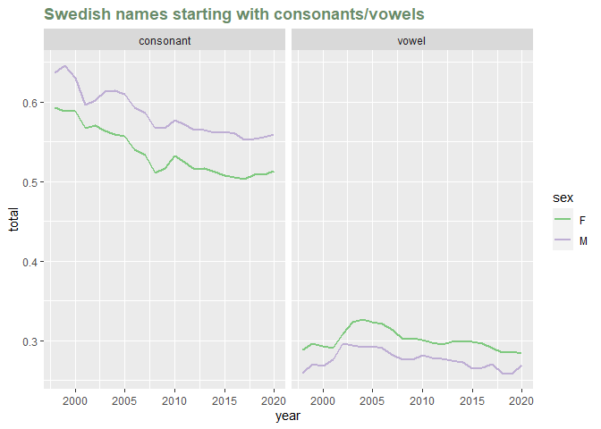

Assignment5
================
Jae Eun Hong
10/5/2021

## Libraries

``` r
library(tidyverse)
library(readxl)
library(dplyr)
library(ggplot2)
library(magrittr)
library(RColorBrewer)
library(babynames)
library(barnnamn)
```

## 1. Reversing classification

``` r
# Simplified csv file of kelly data
temp_data <- read.csv('C:/Users/wk789/Documents/school/UU/data visualisation/assignment5/japankoppenextra.csv')

climateclass <- function(temperatures){
  
  
  
  if(min(temperatures) < 10 & max(temperatures) < 10){
    return ("E")
  } else if(min (temperatures) < 0 & max(temperatures) > 10) {
    return ("D")
  } else if(min(temperatures) > 0 & min(temperatures) < 18 & max(temperatures) > 10){
    return ("C")
  } else{
    return ("A")
  } 
}

city_climate <- tibble(city = character(), 
                       climate = character())

for(c in temp_data %>% pull(city) %>% unique()){

  city_data <- temp_data %>% filter(city == c) %>%  pull( daily_mean)

  clim <- climateclass(city_data)
  city_climate <- city_climate %>% add_row(city = c, climate = clim)

}

city_climate
```

    ## # A tibble: 3 x 2
    ##   city     climate
    ##   <chr>    <chr>  
    ## 1 Tokyo    C      
    ## 2 Sapporo  D      
    ## 3 Takasaki C

## 2. Further climate subdivisions

``` r
climateclass <- function(temperatures, precipitations){
  
  # storing summer / winter precipitation into a variable
  summer_prec <- precipitations %>% filter(month %in% c(6, 7, 8)) %>% pull(precipitation)
  
  winter_prec <- precipitations %>% filter(month %in% c(12, 1, 2)) %>% pull(precipitation)
  
  
  if(min(temperatures) < 10 & max(temperatures) < 10){
    return ("E")
  }
  
  else if(min (temperatures) < 0 & max(temperatures) > 10) {
    if(max(summer_prec) > min(winter_prec) * 10) {
      return("Dw")
    }
    else if( max(winter_prec) > min(summer_prec) * 3 & min(summer_prec) < 40) {
      return("Ds")
    }
    else{
      return("Df")
    }
  } 
  
  else if(min(temperatures) > 0 & min(temperatures) < 18 & max(temperatures) > 10){
    if(max(summer_prec) > min(winter_prec) * 10) {
      return("Cw")
    }
    else if( max(winter_prec) > min(summer_prec) * 3 & min(summer_prec) < 40) {
      return("Cs")
    }
    else{
      return("Cf")
    }
  } 
  
  else{
    return ("A")
  } 
}

city_climate <- tibble(city = character(), 
                       climate = character())

for(c in temp_data %>% pull(city) %>% unique()){

  city_data <- temp_data %>% filter(city == c) %>%  pull( daily_mean)
  precipitation_data <- temp_data %>% filter(city == c) %>% select(c(month, precipitation))

  clim <- climateclass(city_data, precipitation_data)
  city_climate <- city_climate %>% add_row(city = c, climate = clim)

}

city_climate
```

    ## # A tibble: 3 x 2
    ##   city     climate
    ##   <chr>    <chr>  
    ## 1 Tokyo    Cf     
    ## 2 Sapporo  Df     
    ## 3 Takasaki Cw

## 3. RE with Barnnamn data

``` r
vowel_pattern = "^[AEIOUYÅÄÖ]"


vstart_names <- barnnamn$name %>% str_subset(vowel_pattern)

vstart_data <- barnnamn %>% 
  filter(name %in% vstart_names) %>% 
  group_by(year, sex) %>% 
  summarise(total = sum(prop)) %>% 
  mutate(start="vowel")

vstart_data
```

    ## # A tibble: 46 x 4
    ## # Groups:   year [23]
    ##     year sex   total start
    ##    <int> <chr> <dbl> <chr>
    ##  1  1998 F     0.289 vowel
    ##  2  1998 M     0.259 vowel
    ##  3  1999 F     0.296 vowel
    ##  4  1999 M     0.270 vowel
    ##  5  2000 F     0.293 vowel
    ##  6  2000 M     0.269 vowel
    ##  7  2001 F     0.290 vowel
    ##  8  2001 M     0.276 vowel
    ##  9  2002 F     0.309 vowel
    ## 10  2002 M     0.296 vowel
    ## # ... with 36 more rows

``` r
cstart_names <- barnnamn$name %>% str_subset(vowel_pattern, negate=TRUE)

cstart_data <- barnnamn %>% 
  filter(name %in% cstart_names) %>% 
  group_by(year, sex) %>% 
  summarise(total = sum(prop)) %>% 
  mutate(start="consonant")

final_data <- rbind(vstart_data, cstart_data)

ggplot(final_data, aes(x = year, y = total, colour = sex)) + facet_wrap(~start) + geom_line(lwd=1)+ scale_color_brewer(palette = "Accent") +
  ggtitle("Swedish names starting with consonants/vowels")+
  theme(legend.position = "right",
        plot.title = element_text(
          size = rel(1.2), lineheight = .9,
          family = "Calibri", face = "bold", colour="darkseagreen4"
        ))
```

<!-- -->

Names starting with a consonant is more common than the ones with a
vowel on both sex. The distribution of male names beginning with
consonants are inversely proportional to names beginning with vowels.

``` r
vstart_data_for_vowel_plot <- barnnamn %>% 
  filter(name %in% vstart_names) %>% 
  mutate(start = str_extract(name, '^.{1}')) %>% 
  group_by(year, sex, start)%>% 
  summarise(total = sum(prop))
  
# vstart_data_for_vowel_plot

ggplot(vstart_data_for_vowel_plot
, aes(x = year, y = total, colour = sex)) + facet_wrap(~start) + geom_line(lwd=1)+ scale_color_brewer(palette = "Accent") +
  ggtitle("Swedish names starting with vowels")+
  theme(legend.position = "right",
        plot.title = element_text(
          size = rel(1.2), lineheight = .9,
          family = "Calibri", face = "bold", colour="darkseagreen4"
        ))
```

<!-- -->

The vowel ‘A’ and ‘E’ are favoured by both gender. However, for male,
the vowel ‘A’ is most popular for male, and for female, the vowel ‘E’ is
most popular. The special vowels that exist in Swedish (Å, Ö, Ä and Y)
are rarely used in both gender. The fact that ‘Ä’ is only used in female
name and ‘Ö’ in male name through out the time is an interesting point.
It is also intriguing that the vowel ‘Å’ is seldom used for female name
till early 2000s and lost the popularity among female name.

## 4. RE with babynames data

``` r
girls <- babynames %>% filter(sex=='F') %>% group_by(name) %>% summarise(total=sum(n)) %>% arrange(desc(total)) %>% head(5)
girls
```

    ## # A tibble: 5 x 2
    ##   name        total
    ##   <chr>       <int>
    ## 1 Mary      4123200
    ## 2 Elizabeth 1629679
    ## 3 Patricia  1571692
    ## 4 Jennifer  1466281
    ## 5 Linda     1452249

``` r
# mary variant pattern
# Maaria, Maaarja, Mari, Maria, Mariam, Marie
mary = 'Ma{1,2}r[ij][ae]?.*' 

# elizabeth variant pattern 
# Eliza, Elisa, Elissa, Elisabet..
eliza = 'Eli[sz]{1,2}[ae].*'

# patricia variant pattern 
# Patti, Pattie... 
patricia = 'Pat{1,2}.*'

# jeniffer variant pattern 
jennifer = 'Jen+.*'

# linda variant pattern 
#Lindy, lyn, lynda,...

linda = 'L[iy]n.*'

mary_variant <- babynames%>% filter(sex=='F') %>% .$name  %>% str_subset(mary)
eliza_variant <- babynames%>% filter(sex=='F') %>% .$name  %>% str_subset(eliza)
patricia_variant <- babynames%>% filter(sex=='F') %>% .$name  %>% str_subset(patricia)
jennifer_variant <- babynames%>% filter(sex=='F') %>% .$name  %>% str_subset(jennifer)
linda_variant <- babynames%>% filter(sex=='F') %>% .$name  %>% str_subset(linda)


mary_data <- babynames %>% filter(sex=='F') %>% 
  filter(name %in% mary_variant) %>% 
  group_by(year) %>% 
  summarise(total = sum(n)) %>% 
  mutate(original="Mary")

eliza_data <- babynames %>% filter(sex=='F') %>% 
  filter(name %in% eliza_variant) %>% 
  group_by(year) %>% 
  summarise(total = sum(n)) %>% 
  mutate(original="Elizabeth")


patricia_data <- babynames %>% filter(sex=='F') %>% 
  filter(name %in% patricia_variant) %>% 
  group_by(year) %>% 
  summarise(total = sum(n)) %>% 
  mutate(original="Patricia")

jennifer_data <- babynames %>% filter(sex=='F') %>% 
  filter(name %in% jennifer_variant) %>% 
  group_by(year) %>% 
  summarise(total = sum(n)) %>% 
  mutate(original="Jennifer")

linda_data <- babynames %>% filter(sex=='F') %>% 
  filter(name %in% linda_variant) %>% 
  group_by(year) %>% 
  summarise(total = sum(n)) %>% 
  mutate(original="Linda")

final_data <- rbind(mary_data, eliza_data, patricia_data, jennifer_data, linda_data)

final_data <- final_data %>% group_by(original) %>% summarise(total=sum(total)) %>% arrange(desc(total)) %>% head(5)

final_data
```

    ## # A tibble: 5 x 2
    ##   original    total
    ##   <chr>       <int>
    ## 1 Mary      2787431
    ## 2 Linda     2265778
    ## 3 Jennifer  1970724
    ## 4 Patricia  1916279
    ## 5 Elizabeth 1862533

Most of the order has been changed after the recalculation of the totals
across all variants except for the name Mary.
