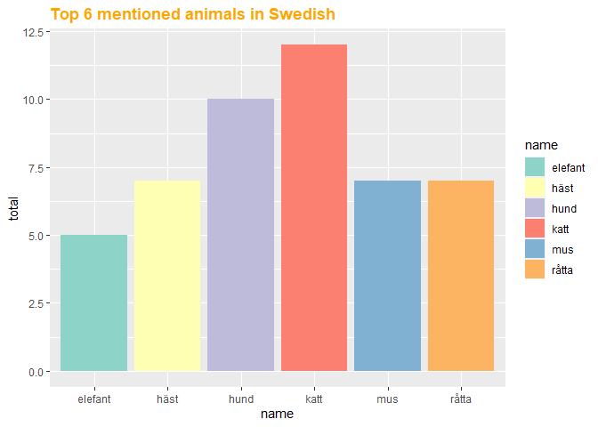
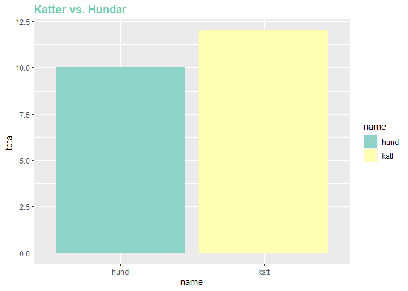
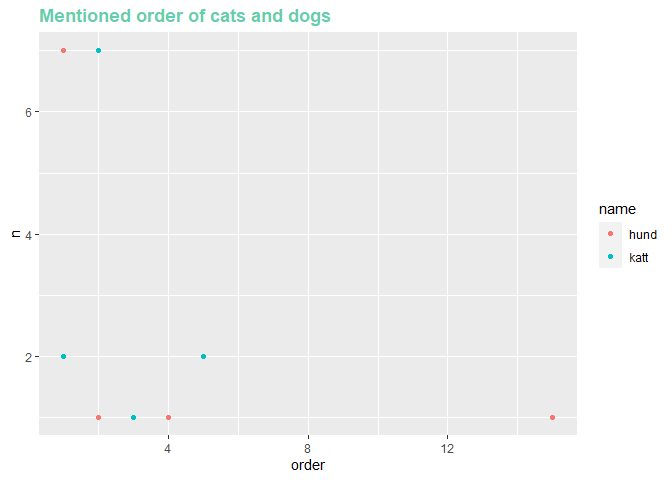

assignment6
================
Jae Eun Hong
10/14/2021

## Libraries

``` r
knitr::opts_chunk$set(warning = FALSE, message = FALSE)
library(tidyverse)
library(readxl)
library(dplyr)
library(readr)
library(ggplot2)
library(magrittr)
library(RColorBrewer)
```

## Reading multiple data file

``` r
setwd('C:/Users/wk789/Documents/school/UU/data visualisation/assignment6/animals_clean')

file_list <- list.files(pattern="swedish*")
print(file_list)
```

    ##  [1] "swedish01.csv" "swedish02.csv" "swedish03.csv" "swedish04.csv"
    ##  [5] "swedish05.csv" "swedish06.csv" "swedish07.csv" "swedish08.csv"
    ##  [9] "swedish09.csv" "swedish10.csv" "swedish11.csv" "swedish12.csv"
    ## [13] "swedish13.csv"

``` r
final <- data.frame()
for (i in 1:length(file_list)) {
  dataset <- read.table(file_list[i],
                        sep = ',',
                        header = T,
                        col.names = c('name', 'translation'),
                        encoding='UTF-8')

  dataset$language <- file_list[i] %>% str_extract(.,pattern = '[a-z]+')
  dataset$id <- i
  dataset$order <- as.numeric(rownames(dataset))
  final <- rbind(final, dataset)
}

final
```

    ##                              name              translation language id order
    ## 1                           Baver                   Beaver  swedish  1     1
    ## 2                           Ratta                      Rat  swedish  1     2
    ## 3                            Katt                      Cat  swedish  1     3
    ## 4                             Alg                    Moose  swedish  1     4
    ## 5                        Kapybara                 Capybara  swedish  1     5
    ## 6                      Fladdermus                      Bat  swedish  1     6
    ## 7                         Spindel                   Spider  swedish  1     7
    ## 8                         Huggorm                    Adder  swedish  1     8
    ## 9                           Langa              Common ling  swedish  1     9
    ## 10                     Sorgmantel           Mourning cloak  swedish  1    10
    ## 11                        Storlom      Black-throated loon  swedish  1    11
    ## 12                      Stenhumla     Red-tailed bumblebee  swedish  1    12
    ## 13                       Papegoja                   Parrot  swedish  1    13
    ## 14                         Kondor                   Condor  swedish  1    14
    ## 15                          Stork                    Stork  swedish  1    15
    ## 16                            Lus                    Louse  swedish  1    16
    ## 17  Silverstreckad parlemorfjaril Silver-washed fritillary  swedish  1    17
    ## 18                        Kanguru                 Kangaroo  swedish  1    18
    ## 19                      Kattuggla                Tawny owl  swedish  1    19
    ## 20                           Hund                      Dog  swedish  2     1
    ## 21                           Katt                      Cat  swedish  2     2
    ## 22                         Giraff                  Giraffe  swedish  2     3
    ## 23                            Alg                    Moose  swedish  2     4
    ## 24                       Flodhast             Hippopotamus  swedish  2     5
    ## 25                     Noshorning               Rhinoceros  swedish  2     6
    ## 26                            Rav                      Fox  swedish  2     7
    ## 27                         Radjur                 Roe deer  swedish  2     8
    ## 28                          Ratta                      Rat  swedish  2     9
    ## 29                       Gravling                   Badger  swedish  2    10
    ## 30                           Mard              Pine marten  swedish  2    11
    ## 31                          Iller                   Ferret  swedish  2    12
    ## 32                          Baver                   Beaver  swedish  2    13
    ## 33                       Hermelin                    Stoat  swedish  2    14
    ## 34                           Hast                    Horse  swedish  2    15
    ## 35                             Ko                      Cow  swedish  2    16
    ## 36                           Katt                      Cat  swedish  3     1
    ## 37                           Hund                      Dog  swedish  3     2
    ## 38                           Hona                      Hen  swedish  3     3
    ## 39                            Rav                      Fox  swedish  3     4
    ## 40                            Val                    Whale  swedish  3     5
    ## 41                            Sal                     Seal  swedish  3     6
    ## 42                     Murmeldjur                   Marmot  swedish  3     7
    ## 43                          Lemur                    Lemur  swedish  3     8
    ## 44                        Surikat                  Meerkat  swedish  3     9
    ## 45                          Uggla                      Owl  swedish  3    10
    ## 46                           Mard              Pine marten  swedish  3    11
    ## 47                         Ekorre                 Squirrel  swedish  3    12
    ## 48                        Valross                   Walrus  swedish  3    13
    ## 49                        Pingvin                  Penguin  swedish  3    14
    ## 50                             Ko                      Cow  swedish  3    15
    ## 51                           Hast                    Horse  swedish  3    16
    ## 52                           Myra                      Ant  swedish  4     1
    ## 53                          Tiger                    Tiger  swedish  4     2
    ## 54                        Elefant                 Elephant  swedish  4     3
    ## 55                           Hund                      Dog  swedish  4     4
    ## 56                           Katt                      Cat  swedish  4     5
    ## 57                            Mus                    Mouse  swedish  4     6
    ## 58                          Ratta                      Rat  swedish  4     7
    ## 59                           Hare                     Hare  swedish  4     8
    ## 60                          Kanin                   Rabbit  swedish  4     9
    ## 61                        Marsvin               Guinea pig  swedish  4    10
    ## 62                         Jaguar                   Jaguar  swedish  4    11
    ## 63                         Panter                  Panther  swedish  4    12
    ## 64                          Panda                    Panda  swedish  4    13
    ## 65                        Hamster                  Hamster  swedish  4    14
    ## 66                      Skalbagge                   Beetle  swedish  4    15
    ## 67                           Hund                      Dog  swedish  5     1
    ## 68                           Katt                      Cat  swedish  5     2
    ## 69                            Mus                    Mouse  swedish  5     3
    ## 70                    Dinosaurier                 Dinosaur  swedish  5     4
    ## 71                          Tiger                    Tiger  swedish  5     5
    ## 72                          Lejon                     Lion  swedish  5     6
    ## 73                        Fasting                     Tick  swedish  5     7
    ## 74                       Papegoja                   Parrot  swedish  5     8
    ## 75                          Fagel                     Bird  swedish  5     9
    ## 76                            Orm                    Snake  swedish  5    10
    ## 77                           Fisk                     Fish  swedish  5    11
    ## 78                       Insekter                   Insect  swedish  5    12
    ## 79                         Maskar                     Worm  swedish  5    13
    ## 80                      Parasiter                 Parasite  swedish  5    14
    ## 81                            Mal                     Moth  swedish  5    15
    ## 82                        Leopard                  Leopard  swedish  6     1
    ## 83                         Giraff                   Girafe  swedish  6     2
    ## 84                        Elefant                 Elephant  swedish  6     3
    ## 85                           Odla                   Lizard  swedish  6     4
    ## 86                     Noshorning               Rhinoceros  swedish  6     5
    ## 87                          Trana                    Crane  swedish  6     6
    ## 88                       Flamingo                 Flamingo  swedish  6     7
    ## 89                            Orm                    Snake  swedish  6     8
    ## 90                            Rav                      Fox  swedish  6     9
    ## 91                            Val                    Whale  swedish  6    10
    ## 92                         Lodjur                     Lynx  swedish  6    11
    ## 93                           Tjur                     Bull  swedish  6    12
    ## 94                          Kamel                    Camel  swedish  6    13
    ## 95                           Raka                   Shrimp  swedish  6    14
    ## 96                           Fisk                     Fish  swedish  6    15
    ## 97                           Hund                      Dog  swedish  7     1
    ## 98                           Katt                      Cat  swedish  7     2
    ## 99                           Hast                    Horse  swedish  7     3
    ## 100                         Tiger                    Tiger  swedish  7     4
    ## 101                         Lejon                     Lion  swedish  7     5
    ## 102                    Noshorning               Rhinoceros  swedish  7     6
    ## 103                       Elefant                 Elephant  swedish  7     7
    ## 104                       Marsvin               Guinea Pig  swedish  7     8
    ## 105                         Ratta                      Rat  swedish  7     9
    ## 106                           Mus                    Mouse  swedish  7    10
    ## 107                         Iller                  Polecat  swedish  7    11
    ## 108                         Utter                    Otter  swedish  7    12
    ## 109                         Baver                   Beaver  swedish  7    13
    ## 110                      Papegoja                   Parrot  swedish  7    14
    ## 111                         Fagel                     Bird  swedish  7    15
    ## 112                          Hund                      Dog  swedish  8     1
    ## 113                          Katt                      Cat  swedish  8     2
    ## 114                       Giraffe                   Girafe  swedish  8     3
    ## 115                       Elefant                 Elephant  swedish  8     4
    ## 116                           Apa                      Ape  swedish  8     5
    ## 117                          Gris                      Pig  swedish  8     6
    ## 118                            Ko                      Cow  swedish  8     7
    ## 119                           Far                    Sheep  swedish  8     8
    ## 120                         Baver                   Beaver  swedish  8     9
    ## 121                        Leguan                   Iguana  swedish  8    10
    ## 122                         Fluga                      Fly  swedish  8    11
    ## 123                         Mygga                 Mosquito  swedish  8    12
    ## 124                         Hasta                    Horse  swedish  8    13
    ## 125                         Ratta                      Rat  swedish  8    14
    ## 126                           Mus                    Mouse  swedish  8    15
    ## 127                          Hund                      Dog  swedish  9     1
    ## 128                          Katt                      Cat  swedish  9     2
    ## 129                      Kapybara                 Capybata  swedish  9     3
    ## 130                       Gorilla                  Gorilla  swedish  9     4
    ## 131                         Zebra                    Zebra  swedish  9     5
    ## 132                    Fladdermus                      Bat  swedish  9     6
    ## 133                           Mus                    Mouse  swedish  9     7
    ## 134                          Hast                    Horse  swedish  9     8
    ## 135                           Haj                    Shark  swedish  9     9
    ## 136                         Manet                Jellyfish  swedish  9    10
    ## 137                       Elefant                 Elephant  swedish  9    11
    ## 138                    Noshorning               Rhinoceros  swedish  9    12
    ## 139                          Sork                     Vole  swedish  9    13
    ## 140                         Kanin                   Rabbit  swedish  9    14
    ## 141                         Lemur                    Lemur  swedish  9    15
    ## 142                          hund                      dog  swedish 10     1
    ## 143                          katt                      cat  swedish 10     2
    ## 144                         ratta                      rat  swedish 10     3
    ## 145                          hast                    horse  swedish 10     4
    ## 146                           far                    sheep  swedish 10     5
    ## 147                           get                     goat  swedish 10     6
    ## 148                          myra                      ant  swedish 10     7
    ## 149                        radjur                 roe-deer  swedish 10     8
    ## 150                           alg                    moose  swedish 10     9
    ## 151                     kronhjort                 red deer  swedish 10    10
    ## 152                         ekoxe              stag beetle  swedish 10    11
    ## 153                          varg                     wolf  swedish 10    12
    ## 154                            lo                     lynx  swedish 10    13
    ## 155                          jarv                wolverine  swedish 10    14
    ## 156                      dovhjort              fallow deer  swedish 10    15
    ## 157                         bjorn                     bear  swedish 11     1
    ## 158                         utter                    otter  swedish 11     2
    ## 159                           rav                      fox  swedish 11     3
    ## 160                            ko                      cow  swedish 11     4
    ## 161                          katt                      cat  swedish 11     5
    ## 162                        lodjur                     lynx  swedish 11     6
    ## 163                           alg                    moose  swedish 11     7
    ## 164                          mard                   marten  swedish 11     8
    ## 165                       akermus              field mouse  swedish 11     9
    ## 166                        lammel                  lemming  swedish 11    10
    ## 167                           orn                    eagle  swedish 11    11
    ## 168                         kraka                     crow  swedish 11    12
    ## 169                         skata                   magpie  swedish 11    13
    ## 170                          duva                     dove  swedish 11    14
    ## 171                          hund                      dog  swedish 11    15
    ## 172                       hamster                  hamster  swedish 11    16
    ## 173                          hund                      dog  swedish 12     1
    ## 174                          katt                      cat  swedish 12     2
    ## 175                         kanin                   rabbit  swedish 12     3
    ## 176                       hamster                  hamster  swedish 12     4
    ## 177                       marsvin               guinea pig  swedish 12     5
    ## 178                          hast                    horse  swedish 12     6
    ## 179                          hona                  chicken  swedish 12     7
    ## 180                          tupp                  rooster  swedish 12     8
    ## 181                         fagel                     bird  swedish 12     9
    ## 182                           mus                    mouse  swedish 12    10
    ## 183                       kanguru                 kangaroo  swedish 12    11
    ## 184                         tiger                    tiger  swedish 12    12
    ## 185                         lejon                     lion  swedish 12    13
    ## 186                       leopard                  leopard  swedish 12    14
    ## 187                           apa                   monkey  swedish 12    15
    ## 188                         koala                    koala  swedish 12    16
    ## 189                          katt                      cat  swedish 13     1
    ## 190                       fiskmas                  seagull  swedish 13     2
    ## 191                      flodhast                    hippo  swedish 13     3
    ## 192                          hast                    horse  swedish 13     4
    ## 193                         lemur                    lemur  swedish 13     5
    ## 194                         lejon                     lion  swedish 13     6
    ## 195                         tiger                    tiger  swedish 13     7
    ## 196                     pappegoja                   parrot  swedish 13     8
    ## 197                          varg                     wolf  swedish 13     9
    ## 198                         bjorn                     bear  swedish 13    10
    ## 199                           orm                    snake  swedish 13    11
    ## 200                       huggorm                    viper  swedish 13    12
    ## 201                       pafagel                  peacock  swedish 13    13
    ## 202                           mus                    mouse  swedish 13    14
    ## 203                         ratta                      rat  swedish 13    15
    ## 204                        giraff                  giraffe  swedish 13    16

I ran into an encoding problem. Swedish characters were not properly
showing due to the wrong encoding. I fixed it with inserting the value
of ‘encoding’ parameter on read.table function into ‘UTF-8’.

## Plotting various graphs

``` r
final$name <- tolower(final$name)
final$translation <- tolower(final$translation)


top6 <- final %>%
  group_by(name) %>% summarize(total = n()) %>% arrange(desc(total))


ggplot(head(top6), aes(x=name, y=total)
)+ geom_bar(aes(fill=name), stat="identity") + scale_fill_brewer(palette = "Set3") +
  ggtitle("Top 6 mentioned animals in Swedish")+
  theme(legend.position = "right",
        plot.title = element_text(
          size = rel(1.2), lineheight = .9,
          family = "Calibri", face = "bold", colour="Orange"
        ))
```

<!-- -->

``` r
cat_dog<-
  final %>% 
  group_by(name) %>% 
  summarize(total=n()) %>% 
  filter(name=='katt'|name=='hund')

ggplot(cat_dog, aes(x=name, y=total)
)+ geom_bar(aes(fill=name), stat="identity") + scale_fill_brewer(palette = "Set3") +
  ggtitle("Katter vs. Hundar")+
  theme(legend.position = "right",
        plot.title = element_text(
          size = rel(1.2), lineheight = .9,
          family = "Calibri", face = "bold", colour="aquamarine3"
        ))
```

<!-- -->

``` r
order_ <- final %>% filter(name=='katt' | name=='hund') %>% group_by(name, order) %>% summarize(n=n()) 

ggplot(order_, aes(x=order, y=n, color=name))+ geom_point()+
  ggtitle("Mentioned order of cats and dogs")+
  theme(legend.position = "right",
        plot.title = element_text(
          size = rel(1.2), lineheight = .9,
          family = "Calibri", face = "bold", colour="aquamarine3"
        ))
```

<!-- -->
