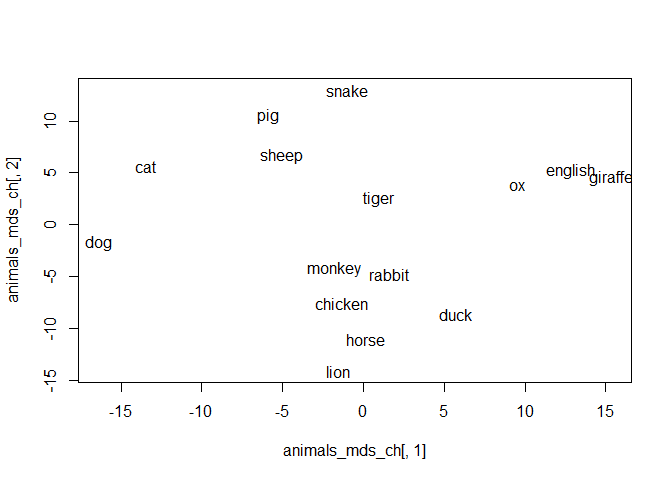
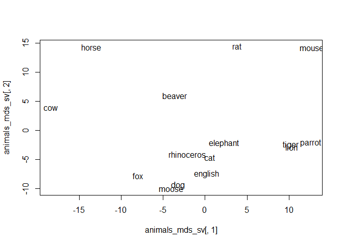
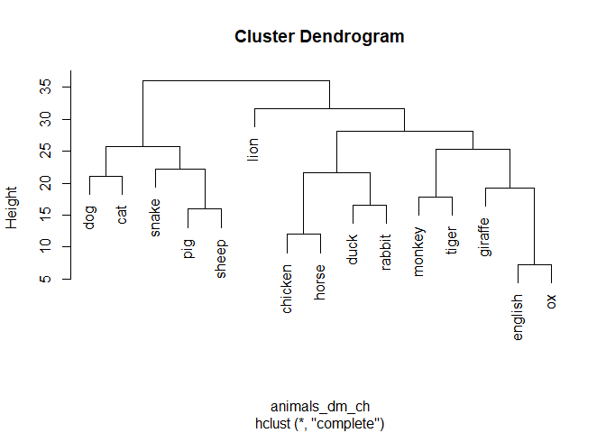
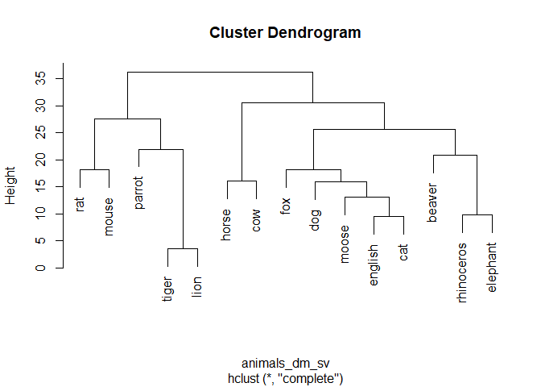

Assignment7
================
Jae Eun Hong
10/19/2021

## Libraries

``` r
knitr::opts_chunk$set(echo = TRUE)
library(tidyverse)
library(readxl)
library(dplyr)
library(readr)
library(ggplot2)
library(magrittr)
library(RColorBrewer)
```

## Read and combine the animal data

``` r
setwd('C:/Users/wk789/Documents/school/UU/data visualisation/assignment6/animals_clean')

file_list <- list.files()
final <- data.frame()
for (i in 1:length(file_list)) {
  dataset <- read.table(file_list[i],
                        sep = ',',
                        header = F,
                        col.names = c('name', 'translation'),
                        encoding='UTF-8',
                        stringsAsFactors = F)
  dataset$language <- file_list[i] %>% str_extract(., 
                                                   pattern = '[a-z]+')
  dataset$id <- i
  dataset$order <- as.numeric(rownames(dataset))
  final <- rbind(final, dataset)
}

final$name = NULL 
final
```

    ##                  translation language id order
    ## 1                    English  chinese  1     1
    ## 2                     monkey  chinese  1     2
    ## 3                    chicken  chinese  1     3
    ## 4                      panda  chinese  1     4
    ## 5                        cat  chinese  1     5
    ## 6                       duck  chinese  1     6
    ## 7                        dog  chinese  1     7
    ## 8                   capybara  chinese  1     8
    ## 9                      whale  chinese  1     9
    ## 10                   dolphin  chinese  1    10
    ## 11                      crab  chinese  1    11
    ## 12                      swan  chinese  1    12
    ## 13                      crow  chinese  1    13
    ## 14                       fox  chinese  1    14
    ## 15                    marmot  chinese  1    15
    ## 16                   gorilla  chinese  1    16
    ## 17                   English  chinese  2     1
    ## 18                       rat  chinese  2     2
    ## 19                        ox  chinese  2     3
    ## 20                     tiger  chinese  2     4
    ## 21                    rabbit  chinese  2     5
    ## 22                     snake  chinese  2     6
    ## 23                     horse  chinese  2     7
    ## 24                     sheep  chinese  2     8
    ## 25                    monkey  chinese  2     9
    ## 26                   chicken  chinese  2    10
    ## 27                       dog  chinese  2    11
    ## 28                       pig  chinese  2    12
    ## 29                      crab  chinese  2    13
    ## 30                  scorpion  chinese  2    14
    ## 31                      lion  chinese  2    15
    ## 32                      fish  chinese  2    16
    ## 33                   English  chinese  3     1
    ## 34                       pig  chinese  3     2
    ## 35                        ox  chinese  3     3
    ## 36                       cat  chinese  3     4
    ## 37                       dog  chinese  3     5
    ## 38                   dolphin  chinese  3     6
    ## 39                     horse  chinese  3     7
    ## 40                      lion  chinese  3     8
    ## 41                     tiger  chinese  3     9
    ## 42                     whale  chinese  3    10
    ## 43                      fish  chinese  3    11
    ## 44                   penguin  chinese  3    12
    ## 45                   chicken  chinese  3    13
    ## 46                     sheep  chinese  3    14
    ## 47                   giraffe  chinese  3    15
    ## 48                    monkey  chinese  3    16
    ## 49                   English  chinese  4     1
    ## 50                  elephant  chinese  4     2
    ## 51                   giraffe  chinese  4     3
    ## 52                      lion  chinese  4     4
    ## 53                     tiger  chinese  4     5
    ## 54                   buffalo  chinese  4     6
    ## 55                rhinoceros  chinese  4     7
    ## 56                     zebra  chinese  4     8
    ## 57                       emu  chinese  4     9
    ## 58                   ostrich  chinese  4    10
    ## 59                    lizard  chinese  4    11
    ## 60                     snake  chinese  4    12
    ## 61                       pig  chinese  4    13
    ## 62                       dog  chinese  4    14
    ## 63                     sheep  chinese  4    15
    ## 64                       cat  chinese  4    16
    ## 65                   English  chinese  5     1
    ## 66                      wolf  chinese  5     2
    ## 67                  squirrel  chinese  5     3
    ## 68                  hedgehog  chinese  5     4
    ## 69                       cat  chinese  5     5
    ## 70                       dog  chinese  5     6
    ## 71                    magpie  chinese  5     7
    ## 72                   seagull  chinese  5     8
    ## 73                   sparrow  chinese  5     9
    ## 74                   penguin  chinese  5    10
    ## 75                polar bear  chinese  5    11
    ## 76                      deer  chinese  5    12
    ## 77                     snake  chinese  5    13
    ## 78                       fox  chinese  5    14
    ## 79                      swan  chinese  5    15
    ## 80                    lizard  chinese  5    16
    ## 81                   English  chinese  6     1
    ## 82                       cat  chinese  6     2
    ## 83                       dog  chinese  6     3
    ## 84                      lion  chinese  6     4
    ## 85                     tiger  chinese  6     5
    ## 86                     snake  chinese  6     6
    ## 87                    rabbit  chinese  6     7
    ## 88                      bird  chinese  6     8
    ## 89                    donkey  chinese  6     9
    ## 90                 cockroach  chinese  6    10
    ## 91                    spider  chinese  6    11
    ## 92                     gecko  chinese  6    12
    ## 93                  silkworm  chinese  6    13
    ## 94                    cicada  chinese  6    14
    ## 95                      moth  chinese  6    15
    ## 96                 butterfly  chinese  6    16
    ## 97                   English  chinese  7     1
    ## 98                       pig  chinese  7     2
    ## 99                       cow  chinese  7     3
    ## 100                    sheep  chinese  7     4
    ## 101                  chicken  chinese  7     5
    ## 102                      dog  chinese  7     6
    ## 103                     duck  chinese  7     7
    ## 104                   monkey  chinese  7     8
    ## 105                    horse  chinese  7     9
    ## 106                   rabbit  chinese  7    10
    ## 107                      cat  chinese  7    11
    ## 108                    eagle  chinese  7    12
    ## 109                     lion  chinese  7    13
    ## 110                    tiger  chinese  7    14
    ## 111                 elephant  chinese  7    15
    ## 112                    goose  chinese  7    16
    ## 113                  English  chinese  8     1
    ## 114                      pig  chinese  8     2
    ## 115                      dog  chinese  8     3
    ## 116                      cat  chinese  8     4
    ## 117                    panda  chinese  8     5
    ## 118                    sheep  chinese  8     6
    ## 119                     bear  chinese  8     7
    ## 120                  giraffe  chinese  8     8
    ## 121                    snake  chinese  8     9
    ## 122                    mouse  chinese  8    10
    ## 123                   rabbit  chinese  8    11
    ## 124                      cow  chinese  8    12
    ## 125                    horse  chinese  8    13
    ## 126                  chicken  chinese  8    14
    ## 127                     duck  chinese  8    15
    ## 128                     fish  chinese  8    16
    ## 129                  English  chinese  9     1
    ## 130                   monkey  chinese  9     2
    ## 131                    panda  chinese  9     3
    ## 132                   pigeon  chinese  9     4
    ## 133                   parrot  chinese  9     5
    ## 134                      owl  chinese  9     6
    ## 135                      bat  chinese  9     7
    ## 136                  chicken  chinese  9     8
    ## 137                     duck  chinese  9     9
    ## 138                    goose  chinese  9    10
    ## 139                   donkey  chinese  9    11
    ## 140                    horse  chinese  9    12
    ## 141                     lion  chinese  9    13
    ## 142                  dolphin  chinese  9    14
    ## 143                    whale  chinese  9    15
    ## 144                      dog  chinese  9    16
    ## 145                  English  chinese 10     1
    ## 146                      cow  chinese 10     2
    ## 147                    sheep  chinese 10     3
    ## 148                    horse  chinese 10     4
    ## 149                   donkey  chinese 10     5
    ## 150                 elephant  chinese 10     6
    ## 151                  giraffe  chinese 10     7
    ## 152                     deer  chinese 10     8
    ## 153                  leopard  chinese 10     9
    ## 154                      pig  chinese 10    10
    ## 155                  sparrow  chinese 10    11
    ## 156                  swallow  chinese 10    12
    ## 157                  penguin  chinese 10    13
    ## 158                     crab  chinese 10    14
    ## 159                  English  chinese 11     1
    ## 160                    Mouse  chinese 11     2
    ## 161                       Ox  chinese 11     3
    ## 162                    Horse  chinese 11     4
    ## 163                    Snake  chinese 11     5
    ## 164                      Pig  chinese 11     6
    ## 165                    Sheep  chinese 11     7
    ## 166                  Chicken  chinese 11     8
    ## 167                   Monkey  chinese 11     9
    ## 168                   Rabbit  chinese 11    10
    ## 169                     Duck  chinese 11    11
    ## 170                    Tiger  chinese 11    12
    ## 171                      Cat  chinese 11    13
    ## 172                      Dog  chinese 11    14
    ## 173                    Horse  chinese 11    15
    ## 174                   Donkey  chinese 11    16
    ## 175                  English  chinese 12     1
    ## 176                     Lion  chinese 12     2
    ## 177                     Wolf  chinese 12     3
    ## 178                    Mouse  chinese 12     4
    ## 179                       Ox  chinese 12     5
    ## 180                    Tiger  chinese 12     6
    ## 181                   Rabbit  chinese 12     7
    ## 182                   Dragon  chinese 12     8
    ## 183                    Snake  chinese 12     9
    ## 184                    Horse  chinese 12    10
    ## 185                    Sheep  chinese 12    11
    ## 186                   Monkey  chinese 12    12
    ## 187                  Chicken  chinese 12    13
    ## 188                      Dog  chinese 12    14
    ## 189                      Pig  chinese 12    15
    ## 190                      Cat  chinese 12    16
    ## 191                  English  chinese 13     1
    ## 192                   Parrot  chinese 13     2
    ## 193                    Shark  chinese 13     3
    ## 194                      Pig  chinese 13     4
    ## 195                       Ox  chinese 13     5
    ## 196                    Sheep  chinese 13     6
    ## 197                  Chicken  chinese 13     7
    ## 198                      Dog  chinese 13     8
    ## 199                     Duck  chinese 13     9
    ## 200                   Monkey  chinese 13    10
    ## 201                    Horse  chinese 13    11
    ## 202                   Rabbit  chinese 13    12
    ## 203                      Cat  chinese 13    13
    ## 204                    Eagle  chinese 13    14
    ## 205                     Bear  chinese 13    15
    ## 206                     Lion  chinese 13    16
    ## 207                  English  chinese 14     1
    ## 208                    Tiger  chinese 14     2
    ## 209                 Elephant  chinese 14     3
    ## 210                    Squid  chinese 14     4
    ## 211                 Elephant  chinese 14     5
    ## 212                  Giraffe  chinese 14     6
    ## 213                     Lion  chinese 14     7
    ## 214                    Panda  chinese 14     8
    ## 215                  Gorilla  chinese 14     9
    ## 216                    Lemur  chinese 14    10
    ## 217                    Snail  chinese 14    11
    ## 218                   Possum  chinese 14    12
    ## 219                    Tiger  chinese 14    13
    ## 220                      Ant  chinese 14    14
    ## 221                   Mantis  chinese 14    15
    ## 222                      Fly  chinese 14    16
    ## 223                  English  swedish 15     1
    ## 224                   Beaver  swedish 15     2
    ## 225                      Rat  swedish 15     3
    ## 226                      Cat  swedish 15     4
    ## 227                    Moose  swedish 15     5
    ## 228                 Capybara  swedish 15     6
    ## 229                      Bat  swedish 15     7
    ## 230                   Spider  swedish 15     8
    ## 231                    Adder  swedish 15     9
    ## 232              Common ling  swedish 15    10
    ## 233           Mourning cloak  swedish 15    11
    ## 234      Black-throated loon  swedish 15    12
    ## 235     Red-tailed bumblebee  swedish 15    13
    ## 236                   Parrot  swedish 15    14
    ## 237                   Condor  swedish 15    15
    ## 238                    Stork  swedish 15    16
    ## 239                    Louse  swedish 15    17
    ## 240 Silver-washed fritillary  swedish 15    18
    ## 241                 Kangaroo  swedish 15    19
    ## 242                Tawny owl  swedish 15    20
    ## 243                  English  swedish 16     1
    ## 244                      Dog  swedish 16     2
    ## 245                      Cat  swedish 16     3
    ## 246                  Giraffe  swedish 16     4
    ## 247                    Moose  swedish 16     5
    ## 248             Hippopotamus  swedish 16     6
    ## 249               Rhinoceros  swedish 16     7
    ## 250                      Fox  swedish 16     8
    ## 251                 Roe deer  swedish 16     9
    ## 252                      Rat  swedish 16    10
    ## 253                   Badger  swedish 16    11
    ## 254              Pine marten  swedish 16    12
    ## 255                   Ferret  swedish 16    13
    ## 256                   Beaver  swedish 16    14
    ## 257                    Stoat  swedish 16    15
    ## 258                    Horse  swedish 16    16
    ## 259                      Cow  swedish 16    17
    ## 260                  English  swedish 17     1
    ## 261                      Cat  swedish 17     2
    ## 262                      Dog  swedish 17     3
    ## 263                      Hen  swedish 17     4
    ## 264                      Fox  swedish 17     5
    ## 265                    Whale  swedish 17     6
    ## 266                     Seal  swedish 17     7
    ## 267                   Marmot  swedish 17     8
    ## 268                    Lemur  swedish 17     9
    ## 269                  Meerkat  swedish 17    10
    ## 270                      Owl  swedish 17    11
    ## 271              Pine marten  swedish 17    12
    ## 272                 Squirrel  swedish 17    13
    ## 273                   Walrus  swedish 17    14
    ## 274                  Penguin  swedish 17    15
    ## 275                      Cow  swedish 17    16
    ## 276                    Horse  swedish 17    17
    ## 277                  English  swedish 18     1
    ## 278                      Ant  swedish 18     2
    ## 279                    Tiger  swedish 18     3
    ## 280                 Elephant  swedish 18     4
    ## 281                      Dog  swedish 18     5
    ## 282                      Cat  swedish 18     6
    ## 283                    Mouse  swedish 18     7
    ## 284                      Rat  swedish 18     8
    ## 285                     Hare  swedish 18     9
    ## 286                   Rabbit  swedish 18    10
    ## 287               Guinea pig  swedish 18    11
    ## 288                   Jaguar  swedish 18    12
    ## 289                  Panther  swedish 18    13
    ## 290                    Panda  swedish 18    14
    ## 291                  Hamster  swedish 18    15
    ## 292                   Beetle  swedish 18    16
    ## 293                  English  swedish 19     1
    ## 294                      Dog  swedish 19     2
    ## 295                      Cat  swedish 19     3
    ## 296                    Mouse  swedish 19     4
    ## 297                 Dinosaur  swedish 19     5
    ## 298                    Tiger  swedish 19     6
    ## 299                     Lion  swedish 19     7
    ## 300                     Tick  swedish 19     8
    ## 301                   Parrot  swedish 19     9
    ## 302                     Bird  swedish 19    10
    ## 303                    Snake  swedish 19    11
    ## 304                     Fish  swedish 19    12
    ## 305                   Insect  swedish 19    13
    ## 306                     Worm  swedish 19    14
    ## 307                 Parasite  swedish 19    15
    ## 308                     Moth  swedish 19    16
    ## 309                  English  swedish 20     1
    ## 310                  Leopard  swedish 20     2
    ## 311                   Girafe  swedish 20     3
    ## 312                 Elephant  swedish 20     4
    ## 313                   Lizard  swedish 20     5
    ## 314               Rhinoceros  swedish 20     6
    ## 315                    Crane  swedish 20     7
    ## 316                 Flamingo  swedish 20     8
    ## 317                    Snake  swedish 20     9
    ## 318                      Fox  swedish 20    10
    ## 319                    Whale  swedish 20    11
    ## 320                     Lynx  swedish 20    12
    ## 321                     Bull  swedish 20    13
    ## 322                    Camel  swedish 20    14
    ## 323                   Shrimp  swedish 20    15
    ## 324                     Fish  swedish 20    16
    ## 325                  English  swedish 21     1
    ## 326                      Dog  swedish 21     2
    ## 327                      Cat  swedish 21     3
    ## 328                    Horse  swedish 21     4
    ## 329                    Tiger  swedish 21     5
    ## 330                     Lion  swedish 21     6
    ## 331               Rhinoceros  swedish 21     7
    ## 332                 Elephant  swedish 21     8
    ## 333               Guinea Pig  swedish 21     9
    ## 334                      Rat  swedish 21    10
    ## 335                    Mouse  swedish 21    11
    ## 336                  Polecat  swedish 21    12
    ## 337                    Otter  swedish 21    13
    ## 338                   Beaver  swedish 21    14
    ## 339                   Parrot  swedish 21    15
    ## 340                     Bird  swedish 21    16
    ## 341                  English  swedish 22     1
    ## 342                      Dog  swedish 22     2
    ## 343                      Cat  swedish 22     3
    ## 344                   Girafe  swedish 22     4
    ## 345                 Elephant  swedish 22     5
    ## 346                      Ape  swedish 22     6
    ## 347                      Pig  swedish 22     7
    ## 348                      Cow  swedish 22     8
    ## 349                    Sheep  swedish 22     9
    ## 350                   Beaver  swedish 22    10
    ## 351                   Iguana  swedish 22    11
    ## 352                      Fly  swedish 22    12
    ## 353                 Mosquito  swedish 22    13
    ## 354                    Horse  swedish 22    14
    ## 355                      Rat  swedish 22    15
    ## 356                    Mouse  swedish 22    16
    ## 357                  English  swedish 23     1
    ## 358                      Dog  swedish 23     2
    ## 359                      Cat  swedish 23     3
    ## 360                 Capybata  swedish 23     4
    ## 361                  Gorilla  swedish 23     5
    ## 362                    Zebra  swedish 23     6
    ## 363                      Bat  swedish 23     7
    ## 364                    Mouse  swedish 23     8
    ## 365                    Horse  swedish 23     9
    ## 366                    Shark  swedish 23    10
    ## 367                Jellyfish  swedish 23    11
    ## 368                 Elephant  swedish 23    12
    ## 369               Rhinoceros  swedish 23    13
    ## 370                     Vole  swedish 23    14
    ## 371                   Rabbit  swedish 23    15
    ## 372                    Lemur  swedish 23    16
    ## 373                  English  swedish 24     1
    ## 374                      dog  swedish 24     2
    ## 375                      cat  swedish 24     3
    ## 376                      rat  swedish 24     4
    ## 377                    horse  swedish 24     5
    ## 378                    sheep  swedish 24     6
    ## 379                     goat  swedish 24     7
    ## 380                      ant  swedish 24     8
    ## 381                 roe-deer  swedish 24     9
    ## 382                    moose  swedish 24    10
    ## 383                 red deer  swedish 24    11
    ## 384              stag beetle  swedish 24    12
    ## 385                     wolf  swedish 24    13
    ## 386                     lynx  swedish 24    14
    ## 387                wolverine  swedish 24    15
    ## 388              fallow deer  swedish 24    16
    ## 389                  English  swedish 25     1
    ## 390                     bear  swedish 25     2
    ## 391                    otter  swedish 25     3
    ## 392                      fox  swedish 25     4
    ## 393                      cow  swedish 25     5
    ## 394                      cat  swedish 25     6
    ## 395                     lynx  swedish 25     7
    ## 396                    moose  swedish 25     8
    ## 397                   marten  swedish 25     9
    ## 398              field mouse  swedish 25    10
    ## 399                  lemming  swedish 25    11
    ## 400                    eagle  swedish 25    12
    ## 401                     crow  swedish 25    13
    ## 402                   magpie  swedish 25    14
    ## 403                     dove  swedish 25    15
    ## 404                      dog  swedish 25    16
    ## 405                  hamster  swedish 25    17
    ## 406                  English  swedish 26     1
    ## 407                      dog  swedish 26     2
    ## 408                      cat  swedish 26     3
    ## 409                   rabbit  swedish 26     4
    ## 410                  hamster  swedish 26     5
    ## 411               guinea pig  swedish 26     6
    ## 412                    horse  swedish 26     7
    ## 413                  chicken  swedish 26     8
    ## 414                  rooster  swedish 26     9
    ## 415                     bird  swedish 26    10
    ## 416                    mouse  swedish 26    11
    ## 417                 kangaroo  swedish 26    12
    ## 418                    tiger  swedish 26    13
    ## 419                     lion  swedish 26    14
    ## 420                  leopard  swedish 26    15
    ## 421                   monkey  swedish 26    16
    ## 422                    koala  swedish 26    17
    ## 423                  English  swedish 27     1
    ## 424                      cat  swedish 27     2
    ## 425                  seagull  swedish 27     3
    ## 426                    hippo  swedish 27     4
    ## 427                    horse  swedish 27     5
    ## 428                    lemur  swedish 27     6
    ## 429                     lion  swedish 27     7
    ## 430                    tiger  swedish 27     8
    ## 431                   parrot  swedish 27     9
    ## 432                     wolf  swedish 27    10
    ## 433                     bear  swedish 27    11
    ## 434                    snake  swedish 27    12
    ## 435                    viper  swedish 27    13
    ## 436                  peacock  swedish 27    14
    ## 437                    mouse  swedish 27    15
    ## 438                      rat  swedish 27    16
    ## 439                  giraffe  swedish 27    17

``` r
# Removing duplicates 
final <- final %>% distinct(., translation, id, .keep_all = TRUE)

# lowercase the animal names 
final$translation <- tolower(final$translation)

swedish <- final %>% filter(language=='swedish') %>% select(-c(language)) 

chinese <- final %>% filter(language=='chinese') %>% 
  select(-c(language))

top15_chinese <- chinese %>% group_by(translation) %>% dplyr::summarize(total=n()) %>% arrange(desc(total)) %>% head(15) %>% select(translation)

top15_swedish <- swedish %>% group_by(translation) %>% dplyr::summarize(total=n()) %>% arrange(desc(total)) %>% head(15) %>% select(translation)

top15_chinese
```

    ## # A tibble: 15 x 1
    ##    translation
    ##    <chr>      
    ##  1 english    
    ##  2 dog        
    ##  3 cat        
    ##  4 chicken    
    ##  5 horse      
    ##  6 lion       
    ##  7 pig        
    ##  8 sheep      
    ##  9 monkey     
    ## 10 tiger      
    ## 11 rabbit     
    ## 12 snake      
    ## 13 duck       
    ## 14 giraffe    
    ## 15 ox

``` r
top15_swedish
```

    ## # A tibble: 15 x 1
    ##    translation
    ##    <chr>      
    ##  1 english    
    ##  2 cat        
    ##  3 dog        
    ##  4 horse      
    ##  5 mouse      
    ##  6 rat        
    ##  7 elephant   
    ##  8 tiger      
    ##  9 beaver     
    ## 10 cow        
    ## 11 fox        
    ## 12 lion       
    ## 13 moose      
    ## 14 parrot     
    ## 15 rhinoceros

``` r
distance <- function(lang_data, top15_name_list) {
  
  name_list <- list()
  
  for (i in 1:nrow(top15_name_list)){
    name_list[i] <- top15_name_list[i,]
  }
  
  
  com_name <- combn(name_list, m=2)
  
  both_animal <- data.frame()
  
  for(i in 1:ncol(com_name)) {
    
    temp = c(com_name[1,i], com_name[2,i])
    a <- lang_data %>% group_by(id) %>% filter(translation%in%temp)
    
    id_idx <- a %>% group_by(id) %>% summarise(n=n()) %>% filter(n == 2) %>% select(id) %>% pull(.)
    
    #print(length(id_idx))
    
    
    animal <- a %>%  group_by(id) %>% filter(id%in%id_idx)
    #print(animal)
    
    both_animal <- rbind(both_animal, animal)}
    both_animal <- both_animal %>% arrange(id)
 
  both_animal_wide <- both_animal %>% distinct()%>% group_by(id, order)  %>% mutate(row=row_number()) %>%  pivot_wider(names_from = id, values_from = order,  values_fill = 0) %>% select(-row)
  # 
  d <- dist(both_animal_wide %>%
             column_to_rownames("translation"), method='euclidean')
  # 
  return(d)
} 

       
chinese_distance <- distance(chinese, top15_chinese)
swedish_distance <- distance(swedish, top15_swedish)
```

## MDS plot for both languages

``` r
#chinese
animals_dm_ch <- as.dist(chinese_distance)
animals_mds_ch <- cmdscale(animals_dm_ch, k=2)
plot(animals_mds_ch[,1], animals_mds_ch[,2], type = "n")
text(animals_mds_ch[,1], animals_mds_ch[,2], label = rownames(animals_mds_ch))
```

<!-- -->

``` r
#swedish
animals_dm_sv <- as.dist(swedish_distance)
animals_dm_sv <- as.dist(swedish_distance)
animals_mds_sv <- cmdscale(animals_dm_sv, k=2)
plot(animals_mds_sv[,1], animals_mds_sv[,2], type = "n")
text(animals_mds_sv[,1], animals_mds_sv[,2], label = rownames(animals_mds_sv))
```

<!-- -->

The result on the MDS plots above for Swedish and Chinese suggest that
animal free-listing is somewhat influenced by the characteristics of
both countries, except for some exceptions, such as rhinoceros,
elephants clustered similar range with domestic cats on the Swedish
animal listing plot. But, generally, MDS plots revealed clusters of
domestic animals, e.g. (cat and dog) and (cows and horse).

## Cluster analysis plot

``` r
# chinese 
ch_cluster <- hclust(animals_dm_ch, method='complete')
plot(ch_cluster)
```

<!-- -->

``` r
sv_cluster <- hclust(animals_dm_sv, method='complete')
plot(sv_cluster)
```

<!-- -->

The Clustering plots clearly shows how far the domestic/exotic animals
are in both countries. In this experiment, I chose furthest neighbour
method to compare the clusters. It clearly showed the far distance
between domestic animals (horse, cows) and exotic animals (tiger, lion)
for Swedish and (cat, dog) and (ox, giraff) for Chinese.
