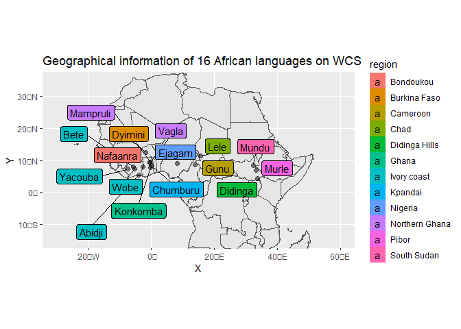
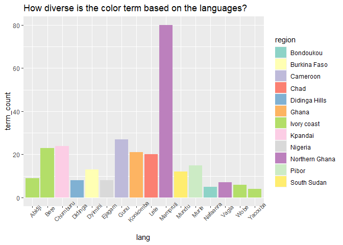
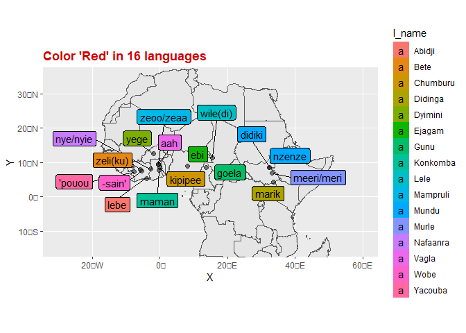
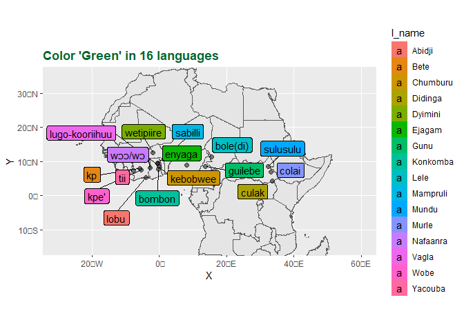
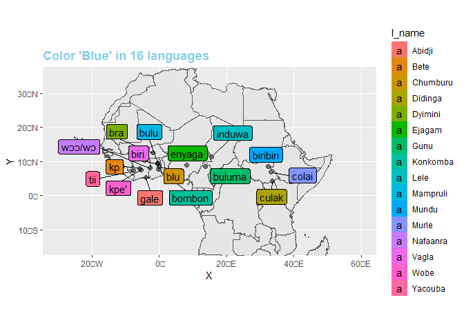
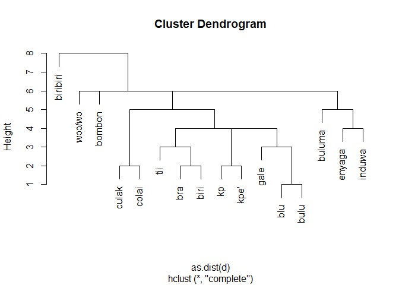

Final assignment
================
Jae Eun Hong
11/2/2021

## 1. Preparations

#### Library setting

``` r
knitr::opts_chunk$set(echo = TRUE)
library(tidyverse)
library(readxl)
library(dplyr)
library(readr)
library(ggplot2)
library(magrittr)
library(RColorBrewer)
library(ggmap)
library(sp)
library(rnaturalearth)
library(sf)
library(rnaturalearthhires)
library(rgeos)
library(ggsflabel)
```

#### Loading data

``` r
# language 
setwd('C:/Users/wk789/Documents/school/UU/data visualisation/final/WCS-Data-20110316/')

lang <- read.table("lang.txt", sep = '\t', encoding = 'UTF-8')
lang$V3 <- tolower(lang$V3)
lang <- lang %>% 
  filter(V3 %in% c('ivory coast', 'ghana', 'chad' , 'cameroon') | V2 %in% c('Bete', 'Chumburu', 'Didinga', 'Dyimini', 'Ejagam', 'Mundu', 'Murle', 'Nafaanra', 'Vagla', 'Wobe', 'Yacouba')) %>%
  select(., select=c('V1', 'V2', 'V3')) 

names(lang) <- c('num', 'lang_name', 'location')

# Dictionary

africa <- lang$num
dict <- read.table("dict.txt", sep = '\t', encoding = 'UTF-8', quote="")
names(dict) <- c('lang', 'term_num', 'term', 'abbr')

dict <- dict %>% filter(lang %in% africa) 
#dict

# Chip information
chip <- read.table("chip.txt", sep = '\t', encoding = 'UTF-8')
names(chip) <- c('chip_num', 'grid_row', 'grid_col', 'conc')
#chip

# WCS focus task response 
foci_exp <- read.table("foci-exp.txt", sep = '\t', encoding = 'UTF-8')
names(foci_exp) <- c('lang', 'speaker', 'focus', 'abbr', 'chip')
foci_exp <- foci_exp %>% filter(lang %in% africa)
#foci_exp

# WCS naming task information (Chip response)
term <- read.table("term.txt", sep = '\t', encoding = 'UTF-8')
names(term) <- c('lang', 'speaker', 'chip', 'abbr')
term <- term %>% filter(.$lang %in% africa)
#term
```

## 2. General overview of 16 African languages

I chose 16 languages of Africa to investigate two research questions:

1.  How diverse is the color terms?
2.  How different is the basic color terms (RGB) among languages? -
    *Does the distance of region matter?*

Below, the 16 languages are listed in the table with the locations. The
main problem was that the majority of the location information was not
clearly stated. I managed to fix this problem by manually searching for
the locations and made a region txt file containing language code,
language name , region, latitude and longitude for the future
geographical analysis. The region table is listed in the second cell
below. The manual searching for the location was mainly based on
Wikipedia and Glottolog.

``` r
lang
```

    ##    num lang_name    location
    ## 1    1    Abidji ivory coast
    ## 2   14      Bete           *
    ## 3   28  Chumburu           *
    ## 4   33   Didinga           *
    ## 5   35   Dyimini           *
    ## 6   36    Ejagam           *
    ## 7   43      Gunu    cameroon
    ## 8   56  Konkomba       ghana
    ## 9   61      Lele        chad
    ## 10  62  Mampruli       ghana
    ## 11  73     Mundu           *
    ## 12  75     Murle           *
    ## 13  77  Nafaanra           *
    ## 14 100     Vagla           *
    ## 15 104      Wobe           *
    ## 16 105   Yacouba           *

``` r
setwd('C:/Users/wk789/Documents/school/UU/data visualisation/final/WCS-Data-20110316/')

region <- read.table("region.txt", sep = ',', encoding = 'UTF-8', header=TRUE)
region
```

    ##    langcode     lang         region  latitude   longitude
    ## 1         1   Abidji    Ivory coast  5.359017 -4.00775462
    ## 2        14     Bete    Ivory coast  7.967300 -5.81121680
    ## 3        28 Chumburu        Kpandai  8.470674 -0.01141551
    ## 4        33  Didinga  Didinga Hills  4.334874 33.58582239
    ## 5        35  Dyimini   Burkina Faso 12.447305 -1.82922406
    ## 6        36   Ejagam        Nigeria  8.990470  8.19405861
    ## 7        43     Gunu       Cameroon  8.522966 13.78814458
    ## 8        56 Konkomba          Ghana  7.686770 -0.30530936
    ## 9        61     Lele           Chad 11.386171 15.61488362
    ## 10       62 Mampruli Northern Ghana  9.545976 -0.45999855
    ## 11       73    Mundu    South Sudan  8.496747 32.40894411
    ## 12       75    Murle          Pibor  6.799665 33.12888554
    ## 13       77 Nafaanra      Bondoukou  8.032671 -2.78851035
    ## 14      100    Vagla Northern Ghana  9.215374 -0.53140968
    ## 15      104     Wobe    Ivory coast  7.422933 -5.41570903
    ## 16      105  Yacouba    Ivory coast  7.248590 -7.54705647

``` r
africa_map <- st_as_sf(ne_countries(scale="large", continent = 'Africa', returnclass = "sf"))
lexical_geodata <- st_as_sf(region, coords = c("longitude", "latitude"), crs = st_crs(africa_map))


ggplot() + 
  geom_sf(data = africa_map) + 
  geom_sf(data = lexical_geodata, xlab='latitude', ylab='longitude', cex=2, alpha=0.5)  + xlim(-30,60) + ylim(-15,35) + 
  ggtitle("Geographical information of 16 African languages on WCS")+geom_sf_label_repel(data=lexical_geodata, aes(label=lang,fill=region), max.overlaps=24)+theme(legend.position = 'right')
```

<!-- -->

All 16 languages that WCS experimented on are spoken around central
Africa spred from East to West. Majority of them are concentrated in
west Africa near Gulf of Guinea.

## 3. The diversity of the color terms in 16 languages of Africa

``` r
color_term <- term %>% group_by(lang) %>% summarise(count = n_distinct(abbr))
region['term_count'] = color_term$count
region
```

    ##    langcode     lang         region  latitude   longitude term_count
    ## 1         1   Abidji    Ivory coast  5.359017 -4.00775462          9
    ## 2        14     Bete    Ivory coast  7.967300 -5.81121680         23
    ## 3        28 Chumburu        Kpandai  8.470674 -0.01141551         24
    ## 4        33  Didinga  Didinga Hills  4.334874 33.58582239          8
    ## 5        35  Dyimini   Burkina Faso 12.447305 -1.82922406         13
    ## 6        36   Ejagam        Nigeria  8.990470  8.19405861          8
    ## 7        43     Gunu       Cameroon  8.522966 13.78814458         27
    ## 8        56 Konkomba          Ghana  7.686770 -0.30530936         21
    ## 9        61     Lele           Chad 11.386171 15.61488362         20
    ## 10       62 Mampruli Northern Ghana  9.545976 -0.45999855         80
    ## 11       73    Mundu    South Sudan  8.496747 32.40894411         12
    ## 12       75    Murle          Pibor  6.799665 33.12888554         15
    ## 13       77 Nafaanra      Bondoukou  8.032671 -2.78851035          5
    ## 14      100    Vagla Northern Ghana  9.215374 -0.53140968          7
    ## 15      104     Wobe    Ivory coast  7.422933 -5.41570903          6
    ## 16      105  Yacouba    Ivory coast  7.248590 -7.54705647          4

``` r
ggplot(region, aes(lang, term_count, fill=region))+ geom_bar(stat="identity")+
  theme(axis.text.x=element_text(angle=45,  size=8))+ scale_fill_brewer(palette = "Set3")+
  ggtitle("How diverse is the color term based on the languages?") 
```

<!-- -->

``` r
#mean(region$term_count)
```

The number of color terms often varies over languages. Here, I
investigated how diverse is the color terms for each region. For the
analysis, I used `term.txt` that contains data for the WCS naming task
(chip responses). In the experiment, the speakers for each language are
asked to name colors that they think of for 330 color chips. The graph
above represents how many unique color terms are used depending on the
languages. The colors filled in the bar tell the regions the language is
spoken. In average, about 17 color terms are named for each 16
languages. However, *Mampruli* , the language spoken around Northern
Ghana reached up to 80, showing the highest diversity of color terms.
Futher, I found that the geological location does not matter to the
diversity of color terms, e.g. *Mampruli* and *Vagla* , the languages
both spoken in Northern Ghana(high geographical proximity) did not have
the similar results, showing the great difference nearly 70 color terms.

## 4. Comparison of color terms on RGB between languages

``` r
# Chip number for RGB
## Red 
red <- chip %>% filter(conc=='G3') %>% select(chip_num) %>% as.character()
## Green
green <- chip %>% filter(conc=='G16') %>% select(chip_num)%>% as.character()
## Blue
blue <- chip %>% filter(conc=='G30') %>% select(chip_num)%>% as.character()


red_term <- term %>% filter(chip == red) %>% group_by(lang, abbr) %>% summarise(count=n()) %>% top_n(1, count)

green_term <- term %>% filter(chip == green) %>% group_by(lang, abbr) %>% summarise(count=n()) %>% top_n(1, count)

blue_term <- term %>% filter(chip == blue) %>% group_by(lang, abbr) %>% summarise(count=n()) %>% top_n(1, count)

insert_word<- function(term, dict, lang, region) {
  term <- term %>% mutate(origin='a')
  term <- term %>% mutate(l_name='a') %>% mutate(longitude=0) %>% mutate(latitude=0)
  for (i in 1:nrow(term)){
    abb <- term[i,]['abbr'] %>% toString()
    lang_num <- term[i,]['lang'] %>% as.integer()
    origin <- dict %>% filter(abbr==abb & lang==lang_num) %>% select(term) %>% toString() 
    term[i,]['origin'] <- origin
    
    n_lang <- lang %>% filter(num==lang_num) %>% select(lang_name) %>% toString()
    term[i,]['l_name'] <- n_lang
    
    term[i,]['longitude'] <- region %>% filter(langcode==lang_num) %>% select(longitude)
    term[i,]['latitude'] <- region %>% filter(langcode==lang_num) %>% select(latitude)
  }
 
  return (term)
}


r_term <- insert_word(red_term, dict, lang, region)
g_term <- insert_word(green_term, dict, lang, region)
b_term <- insert_word(blue_term, dict, lang, region)

lexical_geodata_r <- st_as_sf(r_term, coords = c("longitude", "latitude"), crs = st_crs(africa_map))
lexical_geodata_g <- st_as_sf(g_term, coords = c("longitude", "latitude"), crs = st_crs(africa_map))
lexical_geodata_b <- st_as_sf(b_term, coords = c("longitude", "latitude"), crs = st_crs(africa_map))

# RED
ggplot() + 
  geom_sf(data = africa_map) + 
  geom_sf(data = lexical_geodata_r, xlab='latitude', ylab='longitude', cex=2, alpha=0.5)  +
  xlim(-30,60) + ylim(-15,35) + 
  ggtitle("Color 'Red' in 16 languages")+
  geom_sf_label_repel(data=lexical_geodata_r, aes(label=origin,fill=l_name), max.overlaps=24)+
  theme(legend.position = 'right',
        plot.title = element_text(
          size = rel(1.2), lineheight = .9,
          family = "Calibri", face = "bold", colour="#CC0000")) 
```

<!-- -->

``` r
# GREEN
ggplot() + 
  geom_sf(data = africa_map) + 
  geom_sf(data = lexical_geodata_g, xlab='latitude', ylab='longitude', cex=2, alpha=0.5)  +
  xlim(-30,60) + ylim(-15,35) + 
  ggtitle("Color 'Green' in 16 languages")+
  geom_sf_label_repel(data=lexical_geodata_g, aes(label=origin,fill=l_name), max.overlaps=24)+
  theme(legend.position = 'right',
        plot.title = element_text(
          size = rel(1.2), lineheight = .9,
          family = "Calibri", face = "bold", colour="#006633")) 
```

<!-- -->

``` r
# BLUE
ggplot() + 
  geom_sf(data = africa_map) + 
  geom_sf(data = lexical_geodata_b, xlab='latitude', ylab='longitude', cex=2, alpha=0.5)  +
  xlim(-30,60) + ylim(-15,35) + 
  ggtitle("Color 'Blue' in 16 languages")+
  geom_sf_label_repel(data=lexical_geodata_b, aes(label=origin,fill=l_name), max.overlaps=24)+
  theme(legend.position = 'right',
        plot.title = element_text(
          size = rel(1.2), lineheight = .9,
          family = "Calibri", face = "bold", colour="skyblue"))
```

<!-- -->

Some languages share various similar linguistic features on color terms
when they belong to the same language trees, e.g. *blue* in English and
*blå* in Swedish. I investigated how similar the color terms would be
for 16 languages. First, I chose the general Red, Green, Blue colors on
Figure 1 below (red - `G3`, green-`G16`, blue-`G30`) and chose the term
with the maximum frequency.


There was a limitation to find a distinct similarity/difference between
the languages without the knowledge of each language’s (and cross-)
linguistic features. However, color terms for ‘blue’ showed many
similarities among some languages, such as *biri* (Vagla) -*biribiri*
(Mundu) , *blu* Chumburu)-*bulu* (Mampruli)- *buluma* (Gunu), and
kpe’(Wobe)-kp(Bete). Especially, Wobe and Bete language are classified
as the same language family of Niger–Congo -> Atlantic–Congo-> Kru. In
addition, there was an interesting finding that many languages share
same color terms for both blue and green colors.

## 5. Distance analysis on *Blue*

``` r
blue <- b_term$origin
d <- adist(blue)
rownames(d) <- blue
hc <- hclust(as.dist(d), method='complete')

plot(hc)
```

<!-- -->

For the distance analysis on the color term for *blue*, I used `adist`
function to compute the approximate string distance. It is calculated
between character vectors, using generalized *Levenshtein* (edit)
distance. According to the description, it gives the minimal possibly
weighted number of insertions, deletions and substitutions needed to
transform one string into another. The result, in general, showed the
similar result I mentioned above, such as *kp*-*kpe’* and *blu*-*bulu*
clustered together.

## 6. Conclusion

The 16 languages in Africa region on WCS chip naming task were mostly
spoken slightly above the equator from West to East coast. The number of
color terms varied considerably, from about 10 to 80 with a mean of 17
terms. The cross-linguistic analysis on the main colors terms (Red,
Green, Blue), some languages did not show the distinctly meaningful
features related to geographical conditions, but the map plots for each
color term and the string clustering of a color term broadly showed the
similarities of strings across languages using Levenshtein distance.
